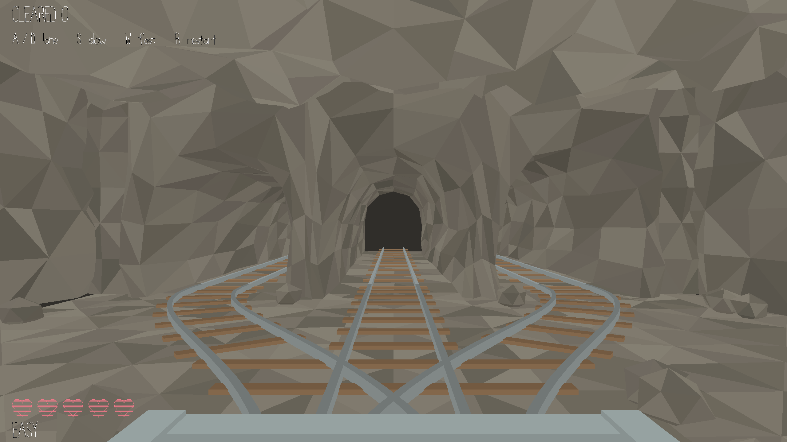
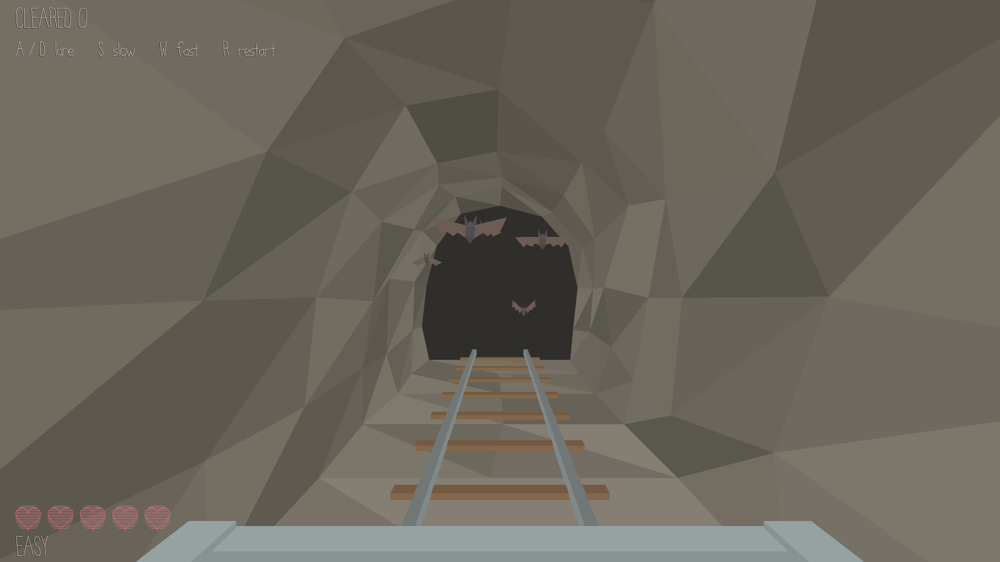
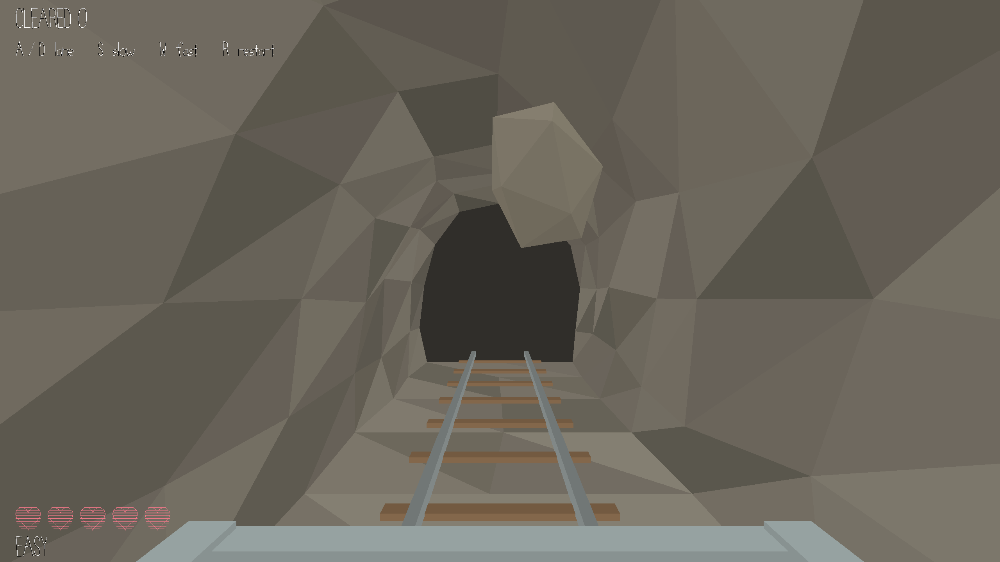

# Cave Mine Cart

- **Author**: Yuchen Zhou
- **Description**: The brakes are gone. Your cart is rolling into a three-way junction, every tunnel mouth is the same black hole, and the lamp died an hour ago. You cannot see which way is safe, so **close your eyes and listen**. A bat squeaks somewhere to your left. Gravel shifts to your right. Pick the quiet one, because once the rails separate there is no going back, and the tunnel will tell you what you chose. **You may want to put your headphones on.**



# Asset Pipeline

## Meshes
Everything in this game was modeled in Blender, flat vertex colors, no textures.

| File | What it holds |
|---|---|
| [`scenes/cave-mine-cart.blend`](scenes/cave-mine-cart.blend) | the junction chamber, three tunnel mouths, the connected three-way rails, edge rubble, and the fixed camera |
| [`scenes/cave-tunnel.blend`](scenes/cave-tunnel.blend) | one reusable 16 m straight tunnel |
| [`scenes/cart-front.blend`](scenes/cart-front.blend) | the cart's front rim and side panels, already parented to `cart_root` |
| [`scenes/bat.blend`](scenes/bat.blend) | a bat, wings on their own pivots |
| [`scenes/rock.blend`](scenes/rock.blend) | one irregular boulder |

Running `make` from `scenes/` invokes the project's Blender exporters and writes two files per model into `assets/`: a `.pnct` holding packed position/normal/color/texcoord vertex data, and a `.scene` holding the transform hierarchy and any camera. `node Maekfile.js` then copies every exported mesh and every sound into `dist/`, so `dist/` is pure build output and **building the game does not require Blender**.

The junction's geometry is the game's ruleset, so the numbers in `PlayMode.hpp` were measured out of the exported vertex data rather than eyeballed: the rails separate at y = 2.1, the branches end at the tunnel mouths at y = 7.7, the lanes sit at x = −4, 0, +4, and the branch angle is therefore `atan(4.0 / 5.6)` = 35.5°, which is exactly how far the cart yaws when it switches rails.

## Sounds
Eight recordings, made on a phone and converted to 48 kHz mono float WAV, which is what `load_wav.cpp` wants and what the mixer reads one `float` at a time:

| | |
|---|---|
| `sounds/env/bats.wav` | the bat warning, and the squeak you hear when you chose wrong |
| `sounds/env/rocks-loose.wav` | the gravel warning |
| `sounds/env/cart-moving-slowly.wav` | rumble loop at low speed |
| `sounds/env/cart-moving-quickly.wav` | rumble loop at high speed |
| `sounds/player/hit-by-bats.wav` | impact |
| `sounds/player/hit-by-rocks.wav` | impact |
| `sounds/player/avoid-sound.wav` | you picked the empty tunnel |
| `sounds/player/game-end.wav` | out of hearts |

**I record everything on my iPhone and some of them are even voice-overs! Try to find them during the game.**

**The warnnings are the whole game.** Warnings use `Sound::play` with an explicit pan of −1.0, 0.0 or +1.0. The equal-power law in `Sound.cpp` makes `pan = −1` give the right channel exactly `sin(0) = 0.0`, so a left-lane warning is silent in your right ear.

# How To Play:

1. You are in the cart. It is **always moving** and it **cannot reverse**. Press **A** and **D** to slide between the left, middle and right lane. The camera leans the way you are aiming, so you can see which mouth you are lined up with even though they all look the same.
2. On the approach you get one warning per dangerous lane. **A squeak in your left ear means bats in the left tunnel.** Gravel in your right ear means a rock on the right. Both ears means the middle. **At least one lane is always safe**.
3. A bat costs **2 HP**, a falling rock costs **5 HP**. You have **5 hearts**, which is 10 HP. But there is no magic mushroom to get your HP back, so treasure them!
4. Once you pass the point where the rails separate, the lane is locked. Hammer them all you like and the only thing you can do is wish you are right.
5. **Wait for the surprise in the tunnel!**

|  |  |
|---|---|
| Wrong lane: five bats, −2 HP | Wrong lane: a boulder, −5 HP |

1. Hold **W** to push the cart to full speed, hold **S** to slow down. Be easy and don't get cocky.
2. It gets worse the longer you survive. Your score is the number of junctions you cleared, top left:

| Junctions | Level | Dangers | Warnings | Cart speed |
|---|---|---|---|---|
| 0–4 | **EASY** | at most one, 80% of the time | twice | slowest |
| 5–9 | **MEDIUM** | one, plus a second 60% of the time | twice | faster |
| 10–14 | **HARD** | always two, one lane left | twice | faster still |
| 15+ | **HELL** | always two | **once only** | maximum |

8. Out of hearts? Press **R** and the mine resets. **Esc** to leave.

## Controls
- **A** / **D** — steer left, middle, right
- **W** (hold) — speed up to maximum
- **S** (hold) — slow to a crawl
- **R** — restart
- **Esc** — quit

# Building

```sh
node Maekfile.js -q               # build dist/game and copy every asset into dist/
node Maekfile.js -q :test-logic   # run the junction rules over 10,000 generated junctions
cd scenes && make                 # re-export the .blend files into assets/ (needs Blender)
```

# Notes
This game was built with [NEST](NEST.md).
